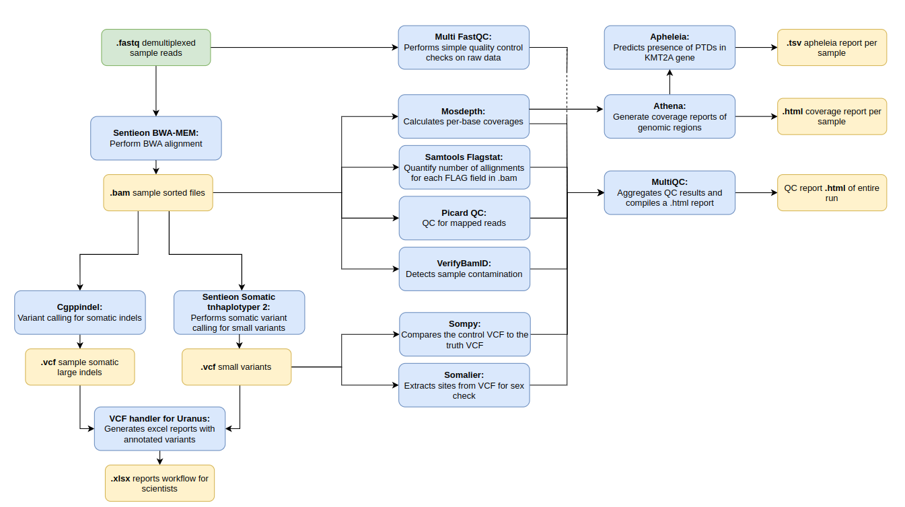

# eggd_uranus_workflow (DNAnexus Platform Workflow)

DNAnexus Uranus workflow to support the Haem-Onc myeloid service

---

## What apps are used in this workflow?

|  App 	| Version  	|
|---	|---	|
|sentieon-bwa   |3.2.0|
|sentieon-tnbam|3.2.0|
|cgppindel          |1.2.0|
|verifybamid        |2.2.1|
|picardqc           |1.1.0|
|samtools_flagstat  |1.1.0|
|mosdepth           |1.1.0|
|athena             |1.4.0|
|somalier_extract   |1.1.0|
|sompy              |1.0.4|
|eggd_vcf_handler_for_uranus|2.8.0|
|eggd_apheleia|1.0.1|
