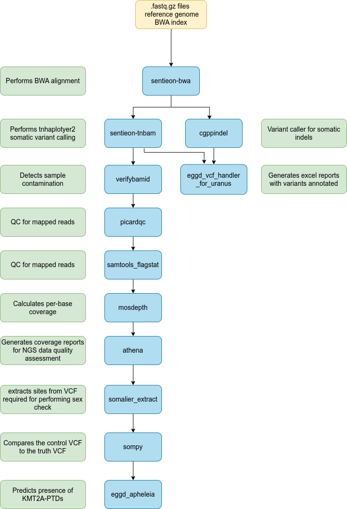

# eggd_uranus_workflow (DNAnexus Platform Workflow)

DNAnexus Uranus workflow to support the Haem-Onc myeloid project

---

## Current Version: 1.11.1

## What apps are used in this workflow?

|  App 	| Version  	|
|---	|---	|
|multi_fastqc       |1.1.0|
|sentieon_bwa_mem   |3.2.0|
|sentieon_bam_to_vcf|3.2.0|
|eggd_vcf_handler_for_uranus|2.6.1|
|cgppindel          |1.0.1|
|verifybamid        |2.1.0|
|picardqc           |1.0.0|
|samtools_flagstat  |1.0.0|
|mosdepth           |1.0.1|
|athena             |1.4.0|
|generate_vcf_metadata |1.0.0|
|somalier_extract   |1.0.2|
|sompy              |1.0.1|

## What version of files are used in this workflow?

|  App 	|  Input file 	| Version  	|
|---	|---	|---	|
|cgppindel|[TA2_S59_L008_tumor_markdup.bam](https://platform.dnanexus.com/panx/projects/G21BGP84q5JFYf168QjZ58Vz/data/?scope=project&id.values=file-Fy9BXxQ40vjGfxP46Jb78Xf1)|not versioned|
||[TA2_S59_L008_tumor_markdup.bam.bai](https://platform.dnanexus.com/panx/projects/G21BGP84q5JFYf168QjZ58Vz/data/?scope=project&id.values=file-Fy9BXxQ40vj7qPJq1Kppjx0F)|not versioned|
||[simpleRepeats_sorted.bed.gz](https://platform.dnanexus.com/panx/projects/G21BGP84q5JFYf168QjZ58Vz/data/?scope=project&id.values=file-Fz0Q2GQ41zgB8BK7143y65Q1)|not versioned|
||[simpleRepeats_sorted.bed.gz.tbi](https://platform.dnanexus.com/panx/projects/G21BGP84q5JFYf168QjZ58Vz/data/?scope=project&id.values=file-Fz0Q2Kj41zg0Fgk4G70P9P1X)|not versioned|
||[coding_unrestricted_GRCh38_myeloid_v1.0.bed](https://platform.dnanexus.com/panx/projects/G21BGP84q5JFYf168QjZ58Vz/data/?scope=project&id.values=file-FybyxV841zgB8v1y3fFbFB0G) |v1.0|
||[normalPanel.gff3.gz](https://platform.dnanexus.com/panx/projects/G21BGP84q5JFYf168QjZ58Vz/data/?scope=project&id.values=file-Fz8Q0vj41zg6j03fP1vbvfFp)|not versioned|
||[targetedRules.lst](https://platform.dnanexus.com/panx/projects/G21BGP84q5JFYf168QjZ58Vz/data/?scope=project&id.values=file-Fz8xvQj41zgGg10ZJzx8Qz53)|not versioned|
||[cgppindel_image.tar.gz](https://platform.dnanexus.com/panx/projects/G21BGP84q5JFYf168QjZ58Vz/data/?scope=project&id.values=file-Fz0KxFj4KB7fxxZ06vy2B2P3)|not versioned|
|verifybamid|[Omni25_genotypes_1525_samples_v2.b38.PASS.ALL.sites.vcf.gz](https://platform.dnanexus.com/panx/projects/G21BGP84q5JFYf168QjZ58Vz/data/?scope=project&id.values=file-G07zJxj41zgF593x6j7bqZ7X)|not versioned|
|picardqc|[Probes_GRCh38_HaemOnc_v2.0.bed](https://platform.dnanexus.com/panx/projects/Fkb6Gkj433GVVvj73J7x8KbV/data/?scope=project&id.values=file-G9vKbv0433GjJv1j7gp0P9vx)|v2.0|
|athena|[hgmd_pro_2020.1_hg38.vcf](https://platform.dnanexus.com/panx/projects/G21BGP84q5JFYf168QjZ58Vz/data/?scope=project&id.values=file-FyZfyqQ41zg5FjK2GykYfKq8)| version 2020.1|
||[exons_cellbase_GRCh38_5bp_flank_v2.0.0.tsv](https://platform.dnanexus.com/panx/projects/Fkb6Gkj433GVVvj73J7x8KbV/data/?scope=project&id.values=file-G9vKbv0433GVJQ4BK701FjBB)| v2.0.0|
||[coding_unrestricted_athena_GRCh38_myeloid_5bp_flank_v2.0.0.bed](https://platform.dnanexus.com/panx/projects/Fkb6Gkj433GVVvj73J7x8KbV/data/?scope=project&id.values=file-G9vKbv0433GxkgqK2GJj79fP)| v2.0.0|
|somalier_extract|[sites.hg38.vcf](https://platform.dnanexus.com/panx/projects/Fkb6Gkj433GVVvj73J7x8KbV/data/?scope=project&id.values=file-G9vXxp8433Gz8jz02fbyKzVj)|not versioned|
|sompy|[Horizon_44799.HD827.hg38.high_confident_NGS_and_ddPCR_variants.vcf.gz](https://platform.dnanexus.com/panx/projects/Fkb6Gkj433GVVvj73J7x8KbV/data/?scope=project&id.values=file-GF3BJJj433Gzgy6qJGx52Gjg)|not versioned|
||[coding_unrestricted_GRCh38_myeloid_5bp_flank_v2.0.0.bed](https://platform.dnanexus.com/panx/projects/Fkb6Gkj433GVVvj73J7x8KbV/data/?scope=project&id.values=file-G9vKbv0433Gg2bP9GP72pxKJ)|v2.0.0|
||[HD827_variant_annotation.bed](https://platform.dnanexus.com/panx/projects/Fkb6Gkj433GVVvj73J7x8KbV/data/?scope=project&id.values=file-GF3BJ1j433GZgy5x486Xyk5B)|not versioned|
||[pkrusche_happy_v0.3.9.tar.gz](https://platform.dnanexus.com/panx/projects/Fkb6Gkj433GVVvj73J7x8KbV/data/?scope=project&id.values=file-GFGbK48433GzV4y54b25p43Z)|v0.3.9|
|eggd_vcf_handler_for_uranus|[coding_unrestricted_GRCh38_myeloid_5bp_flank_v2.0.0.bed](https://platform.dnanexus.com/panx/projects/Fkb6Gkj433GVVvj73J7x8KbV/data/?scope=project&id.values=file-G9vKbv0433Gg2bP9GP72pxKJ)|v2.0.0|
||[pindel_cgppindel_filtering_coordinates_v1.0.bed](https://platform.dnanexus.com/panx/projects/G21BGP84q5JFYf168QjZ58Vz/data/?scope=project&id.values=file-G0bFvXQ433GZJq780QgxZxKf)|v1.0|
||[clinvar_20230218_b38_withchr.vcf.gz](https://platform.dnanexus.com/panx/projects/Fkb6Gkj433GVVvj73J7x8KbV/data/annotation/b38/clinvar)|version 20230218|
||[clinvar_20230218_b38_withchr.vcf.gz.tbi](https://platform.dnanexus.com/panx/projects/Fkb6Gkj433GVVvj73J7x8KbV/data/annotation/b38/clinvar)|version 20230218|
||[gnomad.genomes.r3.0.indel.tsv.gz](https://platform.dnanexus.com/panx/projects/Fkb6Gkj433GVVvj73J7x8KbV/data/?scope=project&id.values=file-G61xbP0433GqX36p8QQxP3PV)|version r3.0|
||[gnomad.genomes.r3.0.indel.tsv.gz.tbi](https://platform.dnanexus.com/panx/projects/Fkb6Gkj433GVVvj73J7x8KbV/data/?scope=project&id.values=file-G61xf3j433Gz49jf6XjKG4F0)|version r3.0|
||[whole_genome_SNVs.tsv.gz](https://platform.dnanexus.com/panx/projects/Fkb6Gkj433GVVvj73J7x8KbV/data/?scope=project&id.values=file-G61xfZ0433Gj2vJ7P8k9ky2Z)| not versioned|
||[whole_genome_SNVs.tsv.gz.tbi](https://platform.dnanexus.com/panx/projects/Fkb6Gkj433GVVvj73J7x8KbV/data/?scope=project&id.values=file-G61y4Y8433GvyjJ52Fj5XjY5)|not versioned|
||[CosmicCodingMuts_GRCh38_v94.normal.vcf.gz](https://platform.dnanexus.com/panx/projects/Fkb6Gkj433GVVvj73J7x8KbV/data/?scope=project&id.values=file-G64Jfk0433GVp0JJPZ4Q8FzJ)|v94|
||[CosmicCodingMuts_GRCh38_v94.normal.vcf.gz.tbi](https://platform.dnanexus.com/panx/projects/Fkb6Gkj433GVVvj73J7x8KbV/data/?scope=project&id.values=file-G64K4bj433GZ35xJJ7YXGvzv)|v94|
||[CosmicNonCodingVariants_GRCh38_v94.normal.vcf.gz](https://platform.dnanexus.com/panx/projects/Fkb6Gkj433GVVvj73J7x8KbV/data/?scope=project&id.values=file-G64K0VQ433GV03462J6GXb9Z)|v94|
||[CosmicNonCodingVariants_GRCh38_v94.normal.vcf.gz.tbi](https://platform.dnanexus.com/panx/projects/Fkb6Gkj433GVVvj73J7x8KbV/data/?scope=project&id.values=file-G64K4j8433Gb0PgpFgbzjj1b)|v94|
||[vep_v103.1_docker.tar.gz](https://platform.dnanexus.com/panx/projects/Fkb6Gkj433GVVvj73J7x8KbV/data/?scope=project&id.values=file-G61zff8433Gy2KQX7Q2z150B)|v103.1|
||[plugin_config.txt](https://platform.dnanexus.com/panx/projects/Fkb6Gkj433GVVvj73J7x8KbV/data/?scope=project&id.values=file-G61zfvj433GxkQXF414xP1yF)| not versioned|
||[ CADD.pm](https://platform.dnanexus.com/panx/projects/Fkb6Gkj433GVVvj73J7x8KbV/data/?scope=project&id.values=file-G620928433Gy9p2b27zb8JFV)|not versioned|
||[Homo_sapiens.GRCh38.dna.toplevel.fa.gz](https://platform.dnanexus.com/panx/projects/Fkb6Gkj433GVVvj73J7x8KbV/data/?scope=project&id.values=file-G61y95Q433Gk05zyFKF9kFv2)|not versioned|
||[Homo_sapiens.GRCh38.dna.toplevel.fa.gz.fai](https://platform.dnanexus.com/panx/projects/Fkb6Gkj433GVVvj73J7x8KbV/data/?scope=project&id.values=file-G61yBV8433GjbVj022PyV3K5)|not versioned|
||[Homo_sapiens.GRCh38.dna.toplevel.fa.gz.gzi](https://platform.dnanexus.com/panx/projects/Fkb6Gkj433GVVvj73J7x8KbV/data/?scope=project&id.values=file-G61yBf0433Gp4BBVGj0jxqvP)|not versioned|
||[homo_sapiens_refseq_vep_103_GRCh38.tar.gz](https://platform.dnanexus.com/panx/projects/Fkb6Gkj433GVVvj73J7x8KbV/data/?scope=project&id.values=file-G61yF38433GQgP504Px5PZ4G)|not versioned|
||[novaseq_205samples_211007.vcf.gz](https://platform.dnanexus.com/panx/projects/Fkb6Gkj433GVVvj73J7x8KbV/data/?scope=project&id.values=file-G5PXK90433GjKFq70yfz9qfZ)| version 211007|
||[novaseq_205samples_211007.vcf.gz.tbi](https://platform.dnanexus.com/panx/projects/Fkb6Gkj433GVVvj73J7x8KbV/data/?scope=project&id.values=file-G5PXKFj433Gv495095Z95pk1)| version 211007|

