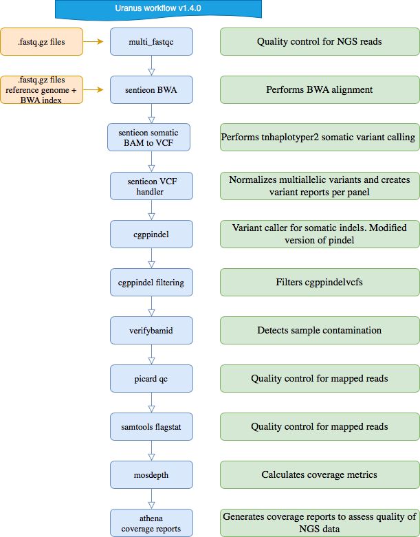

# eggd_uranus_workflow (DNAnexus Platform Workflow)
DNAnexus Uranus workflow to support the Haem-Onc myeloid project

-------

## Current Version: 1.4.0

## What apps are used in this workflow?

|  App 	| Version  	|
|---	|---	|
|multi_fastqc       |1.1.0|
|sentieon_bwa_mem   |2.1.0|
|sentieon_bam_to_vcf|2.1.0|_
|eggd_vcf_handler_for_uranus|2.1.0|
|cgppindel          |1.0.0|
|swiss_army_knife	|4.3.0|
|verifybamid        |2.1.0|
|picardqc           |1.0.0|
|samtools_flagstat  |1.0.0|
|mosdepth           |1.0.1|
|athena             |1.1.2|
